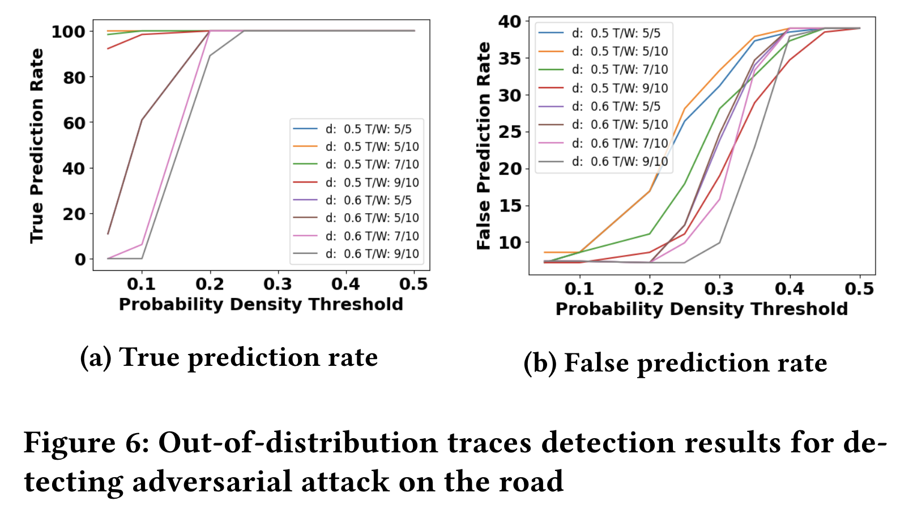

# To run OOD experiments to detect perturbations by adversarial attack (section 6.3)

## To reproduce the results in Table 4

- for generating results for 1 row of the table, ex. W (window_size) = 5, tau (window_threshold) = 5, alpha (prob_threshold) = 0.05, d (initial_memory_threshold) = 0.5 and memory_dir = ./memories/carla_adv_memories_10_$d$: 
`python3 main.py --predict_carla True --initial_memory_threshold 0.5 --memory_dir ./memories/carla_adv_memories_10_0.5 --test_carla_dir ./test_attacks --prob_threshold 0.05 --window_size 5 --window_threshold 5`

The expected table would be  

- for generating results for the entire table (4 rows), please run the following two commands:

- `chmod 777 run_sticker_experiments.sh`
- `./run_sticker_experiments.sh`

It takes about 30 minutes to finish the experiments  
When the script finishes (after viewing **"finish experiment 4/4"**), it will print out all the experimental results and you can also find the results in *./results/carla_sticker_exp_results.txt*

The expected table would be  

## To reproduce Figure 6
We find that it takes about 10 hours to reproduce Figure 6 (8 plots total and 9 points in each plot), so we provide a script to generate one plot only (~an hour).  

- for generating one plot for viewing influence of different window threshold with selected parameters, ex. T = 5, W = 10, d = 0.5, (note that d is 0.5 or 0.6) run following commands
- `chmod 777 run_sticker_experiments_plot.sh`
- `./run_sticker_experiments_plot.sh 5 10 0.5`

When the script finishes (after viewing **"finish one graph in the figure"**), please find the plots in *./results/p_sticker_true_prediction_T_$T$\_W\_$W$\_d\_$d$.png* & *./results/p_sticker_false_prediction_T_$T$\_W\_$W$\_d\_$d$.png*

- for generating total 12 plots (complete figure) for viewing influence of different probability threshold, run following commands
- `chmod 777 run_sticker_all.sh`
- `./run_sticker_all.sh`
- `python3 main.py --plot_full_abalation True`

please find the plots in *./results/p_sticker_true_prediction.png & ./results/p_sticker_false_prediction.png*

The expected figure would be  

## To generate memories from scratch (Optional)

The above experiments use the memories that were used in the experiments for the paper (in *./memories/carla_adv_memories_10_0.5* & *./memories/carla_adv_memories_10_0.6* ). If you want to generate the memories from scratch and then run the above experiments, then please run the following commands before running the experiments

- `chmod 777 run_memory_generation.sh`
- `./run_memory_generation.sh`

Note: The generated memories might differ from the exisitng ones, depending on the value of the initial random seed. 
