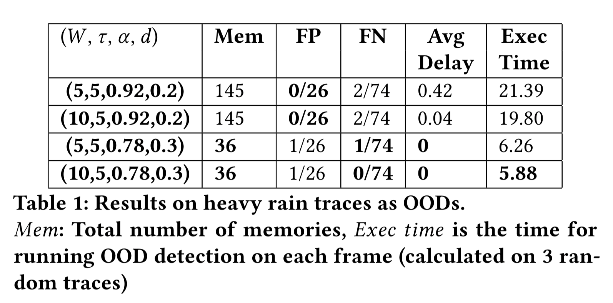

# To reproduce OOD experiments detect change in carla simulation (section 6.1 & 6.2)

## Section 6.1 Detect OOD-ness due to change in weather and lightning

### To reproduce the results in Table 1 (Heavy Rain Scenario)

- for generating results for 1 row of the table, ex. W (window_size) = 5, tau (window_threshold) = 5, alpha (prob_threshold) = 0.92, d (initial_memory_threshold) = 0.2 and memory_dir =  ./memories/carla_memories_10_$d$ = ./memories/carla_memories_10_0.2, task = heavy_rain: `python3 main.py --predict_carla True --memory_dir ./memories/carla_memories_10_0.2  --initial_memory_threshold 0.2 --test_carla_dir ./test_carla --prob_threshold 0.92 --window_size 5 --window_threshold 5 --task heavy_rain`

The expected table would be  

- for generating results for the entire table (4 rows), please run the following two commands:
- `chmod 777 run_heavy_rain_experiments.sh`
- `./run_heavy_rain_experiments.sh`

It takes about ~20 minutes to finish the experiments  
When the script finishes (after viewing **finish heavy rain experiment 4/4**), it will print out all the experimental results and you can also find the results in  *./results/carla_heavy_rain_exp_results.txt*

The expected table would be  

### To reproduce the results in Table 2 (Night and Foggy Scenario)

- for generating results for 1 row of the table, ex. W (window_size) = 5, tau (window_threshold) = 5, alpha (prob_threshold) = 0.92, d (initial_memory_threshold) = 0.2 and memory_dir =  ./memories/carla_memories_10_$d$ = ./memories/carla_memories_10_0.2, task = oods_night (task choices are: oods_night, oods_foggy in this experiment) test_carla_dir=./test_carla/$task: `python3 main.py --predict_carla True --memory_dir ./memories/carla_memories_10_0.2  --initial_memory_threshold 0.2 --test_carla_dir ./test_carla/oods_night --prob_threshold 0.92 --window_size 5 --window_threshold 5 --task oods_night`

The expected table would be  

- for generating results for the entire table (all results for night and foggy OODs), please run the following two commands:
- `chmod 777 run_night_and_foggy.sh`
- `./run_night_and_foggy.sh`

It takes about ~5 minutes to finish the experiments  
When the script finishes (after viewing **finish both experiments**), it will print out all the experimental results and you can also find the results in *./results/carla_oods_night_exp_results.txt* and *./results/carla_oods_foggy_exp_results.txt*

The expected table would be  

## Section 6.2 Detect OOD-ness due to change in front obstacles

### To reproduce the results in Table 3

- for generating results for 1 row of the table, ex. W (window_size) = 5, tau (window_threshold) = 5, alpha (prob_threshold) = 0.92, d (initial_memory_threshold) = 0.2 and memory_dir =  ./memories/carla_memories_10_$d$ = ./memories/carla_memories_10_0.2, task = oods_bike: `python3 main.py --predict_carla True --memory_dir ./memories/carla_memories_10_0.2  --initial_memory_threshold 0.2 --test_carla_dir ./test_carla/oods_bike --prob_threshold 0.92 --window_size 5 --window_threshold 5 --task oods_bike`

The expected table would be  

- for generating results for the entire table (4 rows), please run the following two commands:
- `chmod 777 run_bike_experiments.sh`
- `./run_bike_experiments.sh`

It takes about ~3 minutes to finish the experiments  
When the script finishes (after viewing **"finish bike experiment 4/4"**), it will print out all the experimental results and you can also find the results in *./results/carla_ood_bikes_exp_results.txt*

The expected table would be  

#### Note: The results for FP in table 3 are the same results on FP from Table 1. So, we do not print the FP here again.

## To reproduce Figure 11 (from Appendix)

We find that it takes about 7 hours to reproduce Figure 11 (3 plots total and 21 points in each plot), so we provide a script to generate one plot only (~2 hour).  
- for generating one plot for viewing influence of different window threshold with selected parameters, ex. T = 5, W = 10, run following commands
run 
- `chmod 777 run_heavy_rain_experiments_plot.sh`
- `./run_heavy_rain_experiments_plot.sh 5 10`

When the script finishes (after viewing **"finish one graph in the figure"**), please find the plots in *./results/p_heavy_rain_false_positive_T_$T$\_W\_$W$\_d\_0.2.png* & *./results/p_heavy_rain_false_negative_T_$T$\_W\_$W$\_d\_0.2.png*

The expected figure would be  

## To generate memories from scratch (Optional)

The above experiments use the memories that were used in the experiments for the paper (in *./memories/carla_memories_10_0.2* & *./memories/carla_memories_10_0.3* ). If you want to generate the memories from scratch and then run the above experiments, then please run the following commands before running the experiments  

- `chmod 777 run_carla_memory_generation.sh`
- `./run_carla_memory_generation.sh`

Note: The generated memories might differ from the exisitng ones, depending on the value of the initial random seed. 
